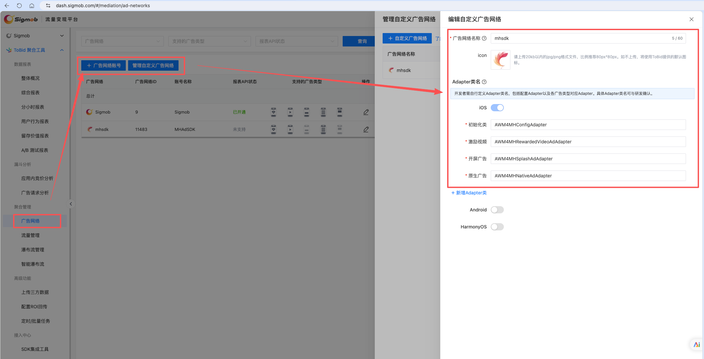
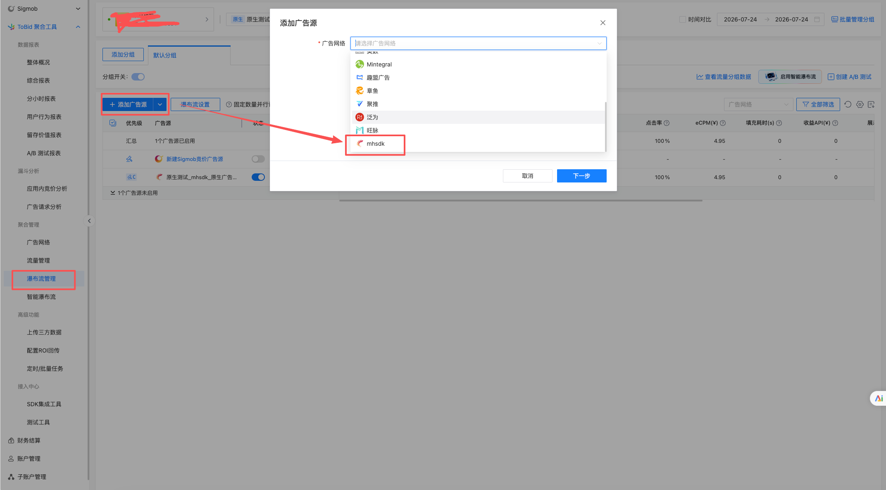
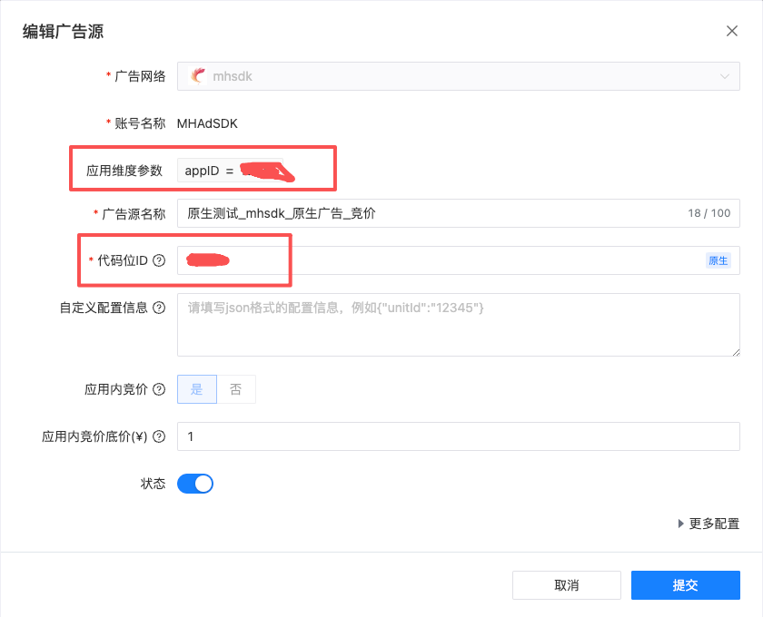

# MHAdSDK-AnyThinkAdapter

MHAdSDK 的 TopOn（Taku）聚合适配器，支持开屏、原生信息流、激励视频三种广告类型。

基于 AnyThinkiOS 新架构（`ATBaseMediationAdapter` + `ATBaseInitAdapter` + `ATAdStatusBridge`），需 AnyThinkiOS ≥ 6.5.80。

## 参考文档

- MHAdSDK 接入文档请参考枫岚SDK开发文档
- TopOn 自定义 ADN 配置请参考：<https://help.takuad.com/docs/CQuN9eZp>

## TopOn 后台配置

> **注意：** 在 TopOn 后台创建自定义 ADN 广告源时，需在广告源参数中填写 `slot_id`（对应 MHAdSDK 的广告位 ID），否则无法请求广告。

### 1. 创建自定义 ADN 广告源



### 2. 瀑布流管理



### 3. 广告源参数配置

在广告源参数中添加 `slot_id`，值为 MHAdSDK 的广告位 ID：



## SDK 初始化

TopOn SDK 在 AppDelegate 中初始化，MHAdSDK 的初始化由适配器 `ATMHAdSDKInitAdapter` 自动处理，**无需**手动调用 MHAdSDK 的注册方法。

```objc
#import <AnyThinkSDK/ATAPI.h>

// TopOn SDK 初始化
NSError *error = nil;
[[ATAPI sharedInstance] startWithAppID:@"your_app_id"
                                appKey:@"your_app_key"
                                 error:&error];
```

## Podfile 配置

```ruby
source 'https://cdn.cocoapods.org/'

platform :ios, '13.0'

target 'MHAdSDKDemo' do
  use_frameworks! :linkage => :static

  # MH 广告 SDK
  pod 'MHAdSDK', '~> 1.4.6'

  # TopOn 聚合平台
  pod 'AnyThinkiOS', '6.5.80'
  pod 'AnyThinkMediationAdxSmartdigimktCNAdapter', '6.5.77.2.0'

  # MHAdSDK TopOn 自定义适配器
  pod 'MHAdSDK-AnyThinkAdapter', :path => './'
end
```

## 接入示例

---

### 开屏广告

> 参考 Demo：`MHSplashViewController`

#### 声明代理

```objc
#import <AnyThinkSDK/ATAdManager.h>
#import <AnyThinkSDK/ATAdManager+Splash.h>
#import <AnyThinkSDK/ATSplashDelegate.h>

@interface MHSplashViewController () <ATSplashDelegate>
@end
```

#### 加载并展示广告

```objc
// 通过 TopOn 加载开屏广告
[[ATAdManager sharedManager] loadADWithPlacementID:self.adID
                                              extra:nil
                                           delegate:self
                                      containerView:self.bottomView];
```

#### 实现代理回调

```objc
#pragma mark - ATSplashDelegate

/// 加载成功，立即展示
- (void)didFinishLoadingADWithPlacementID:(NSString *)placementID {
    UIWindow *window = self.view.window ?: [UIApplication sharedApplication].windows.firstObject;
    [[ATAdManager sharedManager] showSplashWithPlacementID:placementID
                                                    config:nil
                                                    window:window
                                          inViewController:self
                                                     extra:nil
                                                  delegate:self];
}

/// 加载失败
- (void)didFailToLoadADWithPlacementID:(NSString *)placementID error:(NSError *)error {
    NSLog(@"开屏广告加载失败: %@", error);
}

/// 展示成功
- (void)splashDidShowForPlacementID:(NSString *)placementID extra:(NSDictionary *)extra {
    NSNumber *ecpm = extra[kATADDelegateExtraPublisherRevenueKey];
    NSLog(@"开屏广告 eCPM: %@", ecpm);
}

/// 点击
- (void)splashDidClickForPlacementID:(NSString *)placementID extra:(NSDictionary *)extra {
    NSLog(@"开屏广告点击");
}

/// 关闭
- (void)splashDidCloseForPlacementID:(NSString *)placementID extra:(NSDictionary *)extra {
    NSLog(@"开屏广告已关闭");
}
```

---

### 原生信息流广告

> 参考 Demo：`MHNativeViewController`

原生广告通过 TopOn 加载，但使用 MHAdSDK 的 `MHNativeAdView` 直接渲染（支持视频/图片），不走 TopOn 的渲染管线。

适配器在 `ATMHAdSDKNativeDelegate` 中缓存最近一次加载的 `MHNativeAd` 和 `MHNativeAdModel` 数组，VC 在加载成功回调中取出并用于渲染。

#### 声明代理

```objc
#import <AnyThinkSDK/ATAdManager.h>
#import <AnyThinkSDK/ATAdManager+Native.h>
#import <AnyThinkSDK/ATNativeADDelegate.h>
#import <MHAdSDK/MHNativeAd.h>
#import "ATMHAdSDKNativeDelegate.h"

@interface MHNativeViewController () <ATNativeADDelegate>

@property (nonatomic, strong) MHNativeAd *nativeAd;
@property (nonatomic, strong) NSMutableArray<MHNativeAdModel *> *adArray;

@end
```

#### 加载广告

```objc
NSDictionary *extra = @{
    @"MHIsMuted": self.isMuted ? @"1" : @"0",
    @"MHAutoPlayMobileNetwork": self.isAutoPlayMobileNetwork ? @"1" : @"0",
    @"loadCount": @(self.adCount)
};

[[ATAdManager sharedManager] loadADWithPlacementID:self.adID
                                              extra:extra
                                           delegate:self];
```

#### 实现代理回调

```objc
#pragma mark - ATNativeADDelegate

/// 广告加载成功
- (void)didFinishLoadingADWithPlacementID:(NSString *)placementID {
    // 从 adapter 获取 MHNativeAd 和 models（sideband 模式）
    self.nativeAd = [ATMHAdSDKNativeDelegate lastLoadedNativeAd];
    NSArray<MHNativeAdModel *> *models = [ATMHAdSDKNativeDelegate lastLoadedModels];
    [ATMHAdSDKNativeDelegate clearCache];

    if (!self.nativeAd || models.count == 0) {
        NSLog(@"原生广告无填充");
        return;
    }

    self.nativeAd.rootController = self;
    [self.adArray removeAllObjects];
    for (MHNativeAdModel *model in models) {
        [self.adArray addObject:model];
    }

    [self.nativeTableView reloadData];
}

/// 广告加载失败
- (void)didFailToLoadADWithPlacementID:(NSString *)placementID error:(NSError *)error {
    NSLog(@"原生广告加载失败: %@", error.localizedDescription);
}
```

#### 在 TableView Cell 中渲染广告

```objc
// cellForRow 中传递 MHNativeAd 和 MHNativeAdModel
MHNativeListAdCell *cell = [tableView dequeueReusableCellWithIdentifier:@"MHNativeListAdCell"];
cell.nativeAd = self.nativeAd;
MHNativeAdModel *model = self.adArray[indexPath.row];
[cell setCell:model];

// Cell 内部使用 MHAdSDK 渲染：
// self.nativeAdView.adView.nativeAdModel = model;  ← MHNativeAdView 自动处理视频/图片
// [self.nativeAd showInViews:@[self.nativeAdView.adView]
//      withClickableViewsArray:@[@[self.nativeAdView.adButton]]];  ← 曝光+点击追踪
```

---

### 激励视频广告

> 参考 Demo：`MHRewardVideoViewController`

#### 声明代理

```objc
#import <AnyThinkSDK/ATAdManager.h>
#import <AnyThinkSDK/ATAdManager+RewardedVideo.h>
#import <AnyThinkSDK/ATRewardedVideoDelegate.h>

@interface MHRewardVideoViewController () <ATRewardedVideoDelegate>
@end
```

#### 加载并展示广告

```objc
// 通过 extra 传递静音等配置，adapter 中通过 localInfoDic 读取
NSDictionary *extra = @{
    @"MHIsMuted": self.isMuted ? @"1" : @"0"
};

[[ATAdManager sharedManager] loadADWithPlacementID:self.adID
                                              extra:extra
                                           delegate:self];
```

#### 实现代理回调

```objc
#pragma mark - ATRewardedVideoDelegate

/// 加载成功，开始展示
- (void)didFinishLoadingADWithPlacementID:(NSString *)placementID {
    [[ATAdManager sharedManager] showRewardedVideoWithPlacementID:placementID
                                                inViewController:self
                                                        delegate:self];
}

/// 加载失败
- (void)didFailToLoadADWithPlacementID:(NSString *)placementID error:(NSError *)error {
    NSLog(@"激励视频加载失败: %@", error);
}

/// 开始播放
- (void)rewardedVideoDidStartPlayingForPlacementID:(NSString *)placementID extra:(NSDictionary *)extra {
    NSLog(@"激励视频开始播放");
}

/// 播放结束
- (void)rewardedVideoDidEndPlayingForPlacementID:(NSString *)placementID extra:(NSDictionary *)extra {
    NSLog(@"激励视频播放结束");
}

/// 点击
- (void)rewardedVideoDidClickForPlacementID:(NSString *)placementID extra:(NSDictionary *)extra {
    NSLog(@"激励视频点击");
}

/// 关闭（rewarded 表示是否应发放奖励）
- (void)rewardedVideoDidCloseForPlacementID:(NSString *)placementID rewarded:(BOOL)rewarded extra:(NSDictionary *)extra {
    NSLog(@"激励视频关闭 rewarded=%d", rewarded);
}

/// 奖励发放成功
- (void)rewardedVideoDidRewardSuccessForPlacemenID:(NSString *)placementID extra:(NSDictionary *)extra {
    NSLog(@"激励视频奖励发放成功");
}

/// 展示失败
- (void)rewardedVideoDidFailToPlayForPlacementID:(NSString *)placementID error:(NSError *)error extra:(NSDictionary *)extra {
    NSLog(@"激励视频展示失败: %@", error);
}
```

## 注意事项

- `placementID` 使用 TopOn 后台的广告位 ID（不是 MHAdSDK 的 posID）
- MHAdSDK 的广告位 ID 在 TopOn 后台通过广告源参数 `slot_id` 配置
- MHAdSDK 的初始化由 `ATMHAdSDKInitAdapter` 自动处理，无需在 AppDelegate 中手动注册
- 原生广告使用 MHAdSDK 的 `MHNativeAdView` 直接渲染，不依赖 TopOn 的渲染管线
- 原生广告的 `showInViews:withClickableViewsArray:` 用于曝光追踪和点击注册
- C2S Bidding 需要在 adapter 中通过 `ATAdSendC2SBidPriceKey`（NSString）和 `ATAdSendC2SCurrencyTypeKey`（`@(ATBiddingCurrencyTypeCNYCents)`）传递价格
