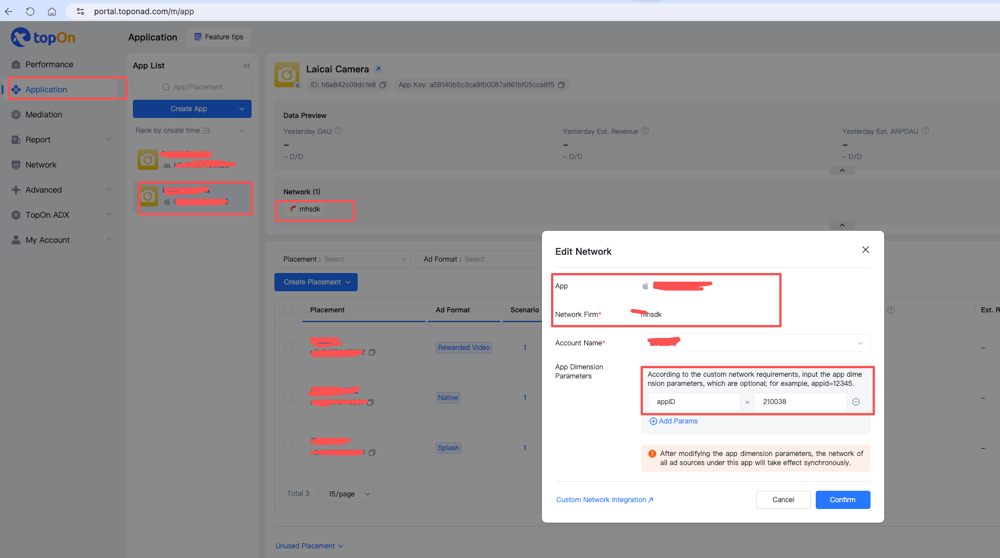
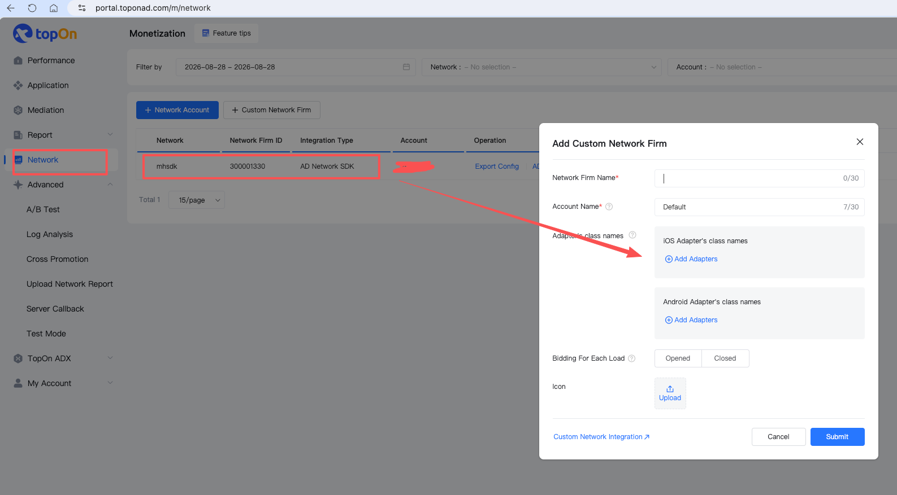
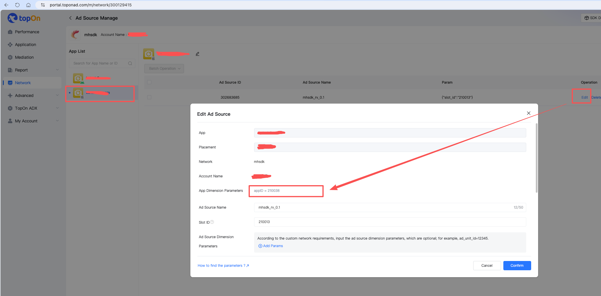

# MHGAdSDK-TopOnAdapter

TopOn (Taku) mediation adapter for MHGAdSDK, supporting Splash, Native Feed, and Rewarded Video ad formats.

Built on the TopOn new architecture (`ATBaseMediationAdapter` + `ATBaseInitAdapter` + `ATAdStatusBridge`), requires TPNiOS >= 6.5.80.

## References

- MHGAdSDK integration guide: MapleHaze SDK Developer Documentation
- TopOn custom ADN configuration: <https://help.takuad.com/docs/CQuN9eZp>

## TopOn Dashboard Configuration

> **Note:** When creating a custom ADN ad source in the TopOn dashboard, you must add `slot_id` (corresponding to the MHGAdSDK placement ID) in the ad source parameters. Otherwise, ad requests will fail.

### 1. Create a Custom ADN Ad Source



### 2. Waterfall Management



### 3. Ad Source Parameters

Add `slot_id` in the ad source parameters, with the value set to your MHGAdSDK placement ID:




### 4. Adapter Class Names

| Type                 | Adapter Name              |
| -------------------- | ------------------------- |
| SplahshAdapter       | MHGATSplahshAdapter       |
| NativeAdapter        | MHGATNativeAdapter        |
| RewardedVideoAdapter | MHGATRewardedVideoAdapter |
| InterstitialAdapter  | MHGATInterstitialAdapter  |


## SDK Initialization

The TopOn SDK is initialized in AppDelegate. MHGAdSDK initialization is handled automatically by the adapter's `ATMHAdSDKInitAdapter` — **no manual registration is required**.

```objc
#import <TPNiOS/ATAPI.h>

// TopOn SDK initialization
NSError *error = nil;
[[ATAPI sharedInstance] startWithAppID:@"your_app_id"
                                appKey:@"your_app_key"
                                 error:&error];
```

## Podfile

```ruby
source 'https://cdn.cocoapods.org/'

platform :ios, '13.0'

target 'MHAdSDKDemo' do
  use_frameworks! :linkage => :static

  # MH Ad SDK
  pod 'MHGAdSDK', '~> 1.4.6'

  # TopOn mediation platform
  pod 'TPNiOS', '6.5.80'
  pod 'TPNMediationAdxSmartdigimktCNAdapter', '6.5.77.2.0'

  # MHGAdSDK TopOn custom adapter
  pod 'MHGAdSDK-TopOnAdapter', :path => './'
end
```

## Integration Examples

---

### Splash Ad

> See Demo: `MHSplashViewController`

#### Declare Delegate

```objc
#import <TPNiOS/ATAdManager.h>
#import <TPNiOS/ATAdManager+Splash.h>
#import <TPNiOS/ATSplashDelegate.h>

@interface MHSplashViewController () <ATSplashDelegate>
@end
```

#### Load and Show Ad

```objc
// Load splash ad via TopOn
[[ATAdManager sharedManager] loadADWithPlacementID:self.adID
                                              extra:nil
                                           delegate:self
                                      containerView:self.bottomView];
```

#### Implement Delegate Callbacks

```objc
#pragma mark - ATSplashDelegate

/// Load succeeded — show immediately
- (void)didFinishLoadingADWithPlacementID:(NSString *)placementID {
    UIWindow *window = self.view.window ?: [UIApplication sharedApplication].windows.firstObject;
    [[ATAdManager sharedManager] showSplashWithPlacementID:placementID
                                                    config:nil
                                                    window:window
                                          inViewController:self
                                                     extra:nil
                                                  delegate:self];
}

/// Load failed
- (void)didFailToLoadADWithPlacementID:(NSString *)placementID error:(NSError *)error {
    NSLog(@"Splash ad load failed: %@", error);
}

/// Ad shown
- (void)splashDidShowForPlacementID:(NSString *)placementID extra:(NSDictionary *)extra {
    NSNumber *ecpm = extra[kATADDelegateExtraPublisherRevenueKey];
    NSLog(@"Splash eCPM: %@", ecpm);
}

/// Clicked
- (void)splashDidClickForPlacementID:(NSString *)placementID extra:(NSDictionary *)extra {
    NSLog(@"Splash ad clicked");
}

/// Closed
- (void)splashDidCloseForPlacementID:(NSString *)placementID extra:(NSDictionary *)extra {
    NSLog(@"Splash ad closed");
}
```

---

### Native Feed Ad

> See Demo: `MHNativeViewController`

Native ads are loaded via TopOn but rendered directly using MHGAdSDK's `MHNativeAdView` (supporting video/image), bypassing TopOn's rendering pipeline.

The adapter caches the most recent `MHNativeAd` and `MHNativeAdModel` array in `ATMHAdSDKNativeDelegate`. The VC retrieves them in the load-success callback for rendering.

#### Declare Delegate

```objc
#import <TPNiOS/ATAdManager.h>
#import <TPNiOS/ATAdManager+Native.h>
#import <TPNiOS/ATNativeADDelegate.h>
#import <MHGAdSDK/MHNativeAd.h>
#import "ATMHAdSDKNativeDelegate.h"

@interface MHNativeViewController () <ATNativeADDelegate>

@property (nonatomic, strong) MHNativeAd *nativeAd;
@property (nonatomic, strong) NSMutableArray<MHNativeAdModel *> *adArray;

@end
```

#### Load Ad

```objc
NSDictionary *extra = @{
    @"MHIsMuted": self.isMuted ? @"1" : @"0",
    @"MHAutoPlayMobileNetwork": self.isAutoPlayMobileNetwork ? @"1" : @"0",
    @"loadCount": @(self.adCount)
};

[[ATAdManager sharedManager] loadADWithPlacementID:self.adID
                                              extra:extra
                                           delegate:self];
```

#### Implement Delegate Callbacks

```objc
#pragma mark - ATNativeADDelegate

/// Ad loaded successfully
- (void)didFinishLoadingADWithPlacementID:(NSString *)placementID {
    // Retrieve MHNativeAd and models from adapter (sideband mode)
    self.nativeAd = [ATMHAdSDKNativeDelegate lastLoadedNativeAd];
    NSArray<MHNativeAdModel *> *models = [ATMHAdSDKNativeDelegate lastLoadedModels];
    [ATMHAdSDKNativeDelegate clearCache];

    if (!self.nativeAd || models.count == 0) {
        NSLog(@"Native ad: no fill");
        return;
    }

    self.nativeAd.rootController = self;
    [self.adArray removeAllObjects];
    for (MHNativeAdModel *model in models) {
        [self.adArray addObject:model];
    }

    [self.nativeTableView reloadData];
}

/// Ad load failed
- (void)didFailToLoadADWithPlacementID:(NSString *)placementID error:(NSError *)error {
    NSLog(@"Native ad load failed: %@", error.localizedDescription);
}
```

#### Render Ad in TableView Cell

```objc
// Pass MHNativeAd and MHNativeAdModel in cellForRow
MHNativeListAdCell *cell = [tableView dequeueReusableCellWithIdentifier:@"MHNativeListAdCell"];
cell.nativeAd = self.nativeAd;
MHNativeAdModel *model = self.adArray[indexPath.row];
[cell setCell:model];

// Cell renders using MHGAdSDK internally:
// self.nativeAdView.adView.nativeAdModel = model;  <- MHNativeAdView handles video/image automatically
// [self.nativeAd showInViews:@[self.nativeAdView.adView]
//      withClickableViewsArray:@[@[self.nativeAdView.adButton]]];  <- impression + click tracking
```

---

### Rewarded Video Ad

> See Demo: `MHRewardVideoViewController`

#### Declare Delegate

```objc
#import <TPNiOS/ATAdManager.h>
#import <TPNiOS/ATAdManager+RewardedVideo.h>
#import <TPNiOS/ATRewardedVideoDelegate.h>

@interface MHRewardVideoViewController () <ATRewardedVideoDelegate>
@end
```

#### Load and Show Ad

```objc
// Pass mute config via extra; adapter reads from localInfoDic
NSDictionary *extra = @{
    @"MHIsMuted": self.isMuted ? @"1" : @"0"
};

[[ATAdManager sharedManager] loadADWithPlacementID:self.adID
                                              extra:extra
                                           delegate:self];
```

#### Implement Delegate Callbacks

```objc
#pragma mark - ATRewardedVideoDelegate

/// Load succeeded — start showing
- (void)didFinishLoadingADWithPlacementID:(NSString *)placementID {
    [[ATAdManager sharedManager] showRewardedVideoWithPlacementID:placementID
                                                inViewController:self
                                                        delegate:self];
}

/// Load failed
- (void)didFailToLoadADWithPlacementID:(NSString *)placementID error:(NSError *)error {
    NSLog(@"Rewarded video load failed: %@", error);
}

/// Playback started
- (void)rewardedVideoDidStartPlayingForPlacementID:(NSString *)placementID extra:(NSDictionary *)extra {
    NSLog(@"Rewarded video started playing");
}

/// Playback ended
- (void)rewardedVideoDidEndPlayingForPlacementID:(NSString *)placementID extra:(NSDictionary *)extra {
    NSLog(@"Rewarded video playback ended");
}

/// Clicked
- (void)rewardedVideoDidClickForPlacementID:(NSString *)placementID extra:(NSDictionary *)extra {
    NSLog(@"Rewarded video clicked");
}

/// Closed (rewarded indicates whether the reward should be granted)
- (void)rewardedVideoDidCloseForPlacementID:(NSString *)placementID rewarded:(BOOL)rewarded extra:(NSDictionary *)extra {
    NSLog(@"Rewarded video closed rewarded=%d", rewarded);
}

/// Reward granted
- (void)rewardedVideoDidRewardSuccessForPlacemenID:(NSString *)placementID extra:(NSDictionary *)extra {
    NSLog(@"Rewarded video reward granted");
}

/// Show failed
- (void)rewardedVideoDidFailToPlayForPlacementID:(NSString *)placementID error:(NSError *)error extra:(NSDictionary *)extra {
    NSLog(@"Rewarded video show failed: %@", error);
}
```

## Notes

- `placementID` uses the TopOn dashboard placement ID (not the MHGAdSDK posID)
- MHGAdSDK placement IDs are configured in the TopOn dashboard via the `slot_id` ad source parameter
- MHGAdSDK initialization is handled automatically by `ATMHAdSDKInitAdapter` — no manual registration needed in AppDelegate
- Native ads use MHGAdSDK's `MHNativeAdView` for rendering directly, without depending on TopOn's rendering pipeline
- `showInViews:withClickableViewsArray:` is used for impression tracking and click registration on native ads
- For C2S Bidding, the adapter must pass the price via `ATAdSendC2SBidPriceKey` (NSString) and `ATAdSendC2SCurrencyTypeKey` (`@(ATBiddingCurrencyTypeCNYCents)`)
